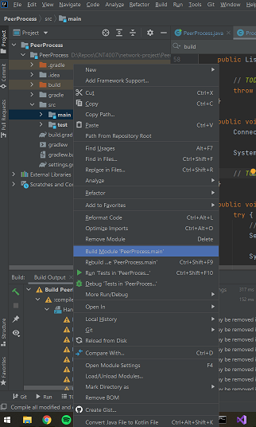
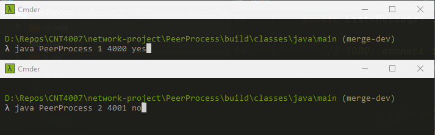
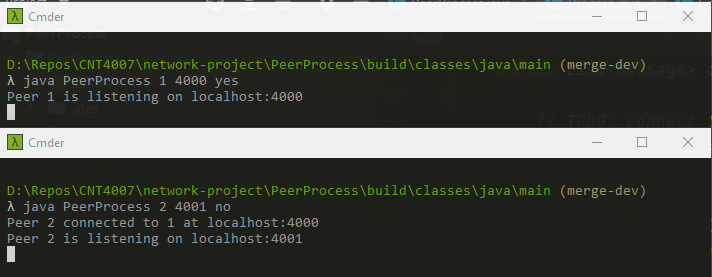

# Network Project Fall 2021

## Teammates

Allison Wu, Brian Koehler, Anurag Akkiraju

---

## Compiling the project

1. Build the project from IntelliJ at `<repo-base-path>/PeerProcess/src/main`

- 

---

## Running the project

1. Then open a terminal for the first and second peer, each at `<repo-base-path>/PeerProcess/build/classes/main`. This is where the compiled project files go.

2. Then run the PeerProcess for both peers in order (top window then bottom window).

- 

3. After running the above commands, you should see the following outputs:

- 

- Note: If the peer is not the first peer, it builds a connection to only one peer before it, and assumes the peer has an id and host equal to its own value - 1

- Here, the second peer with id 2 that listens at localhost:4001 connects to the peer at id 1 that listens at localhost:4001.

---

## Running on Dungeon Computers (DEV)

At Path "<Repo-Base>/PeerProcess/src/main/java", run: `rm -rf ../../../build mkdir ../../../build && javac -d ../../../build/classes/java/main *.java && cd ../../../build && mkdir resources && cd resources && mkdir main && cd main && cp ../../../src/main/resources/PeerInfo.cfg ./PeerInfo.cfg && cp ../../../src/main/resources/Common.cfg ./Common.cfg && cd ../../classes/java/main/`
  
Then run the project with: `java PeerProcess <peerid>`
  - For the simplest scenario, we will use peerId=1001 & 1002
