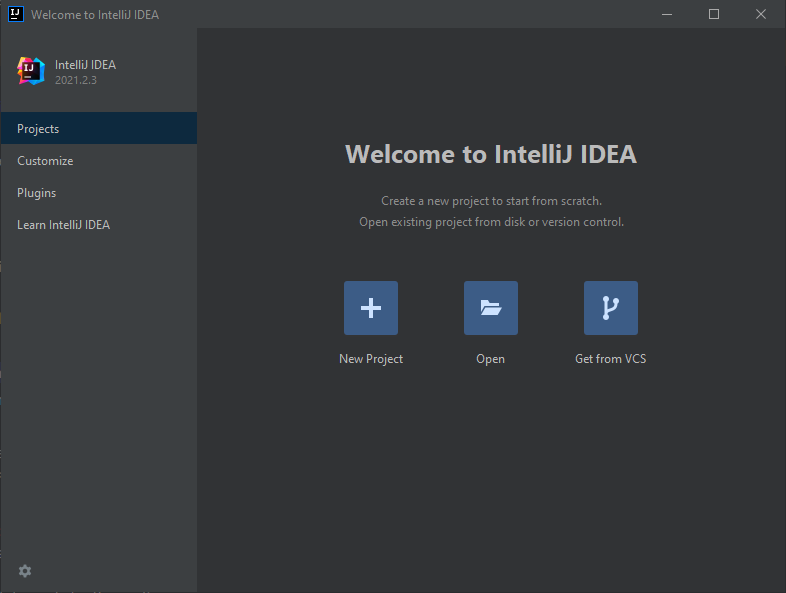
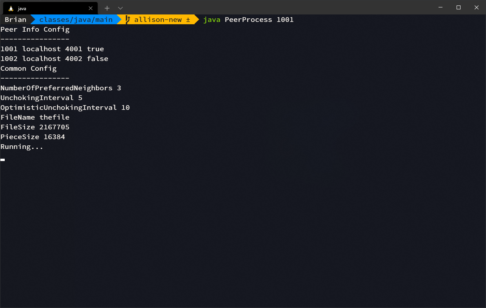

# Network Project Fall 2021


## Teammates

Allison Wu, Brian Koehler, Anurag Akkiraju


---


## Compilation

Compilation of this project requires the following:

- [IntelliJ IDEA](https://www.jetbrains.com/idea/)
- Gradle, Gradle Extension plugins for IntelliJ (installed by default)
- [Java Development Kit](https://www.oracle.com/java/technologies/downloads/)

In order to compile the project:

1. Download the zip file that is submitted.
2. Unzip the downloaded file.
3. Launch IntelliJ. You should see the window pictured below.



4. Select Open or Import and navigate to and open `/network-project/PeerProcess/` from the unzipped file.
5. A new window should open appearing like below. If you wish to configure anything before building, please refer to the [Configuration](#configuration) section. Otherwise, right click PeerProcess on the left side in the project structure and click the Build Module 'PeerProcess' option.


6. Open the build tab in the bottom left and ensure that the console reads `BUILD SUCCESSFUL` (view previous screenshot).


---


## Execution

The example here will only be with 2 peers. However, more peers may be used if [configured correctly](#configuration).

In order to execute the project:

1. Follow the compilation directions from the previous section.
2. Navigate to `network-project/PeerProcess/build/classes/java/main/` in the unzipped file.
3. Run the command `java PeerProcess 1001`. You should see output similar to the screenshot below.



4. In order to run a second peer locally, open a separate terminal window and follow steps 2 and 3, but replace `1001` with `1002`. The output should be similar too the screenshot below.


---


## Demonstration

[Click here](https://youtube.com/) to visit a URL with a demonstration video.


---


## Configuration

**NOTE: Any change in configuration requires the project to be rebuilt.**

The configuration file located at `network-project/PeerProcess/src/main/resources/Common.cfg` follows the same specifications outlined in the project description. Certify that `FileName` and `FileSize` are correct.

For example:

```
NumberOfPreferredNeighbors 3
UnchokingInterval 5
OptimisticUnchokingInterval 10
FileName thefile
FileSize 2167705
PieceSize 16384
```

The peers involved can also be configured at `network-project/PeerProcess/src/main/resources/PeerInfo.cfg`. This file also follows the specification located in the project description.

For example:

```
1001 localhost 4123 1
1002 localhost 4124 0
1003 localhost 4125 0
1004 localhost 4126 0
```

When adding or removing additional peers, you must also make directories corresponding to their ID inside `network-project/PeerProcess/src/main/resources/`, e.g. `1001/` or `1002/`. Furthermore, if a peer is stated to have the file inside `PeerInfo.cfg`, you must have a copy of the file inside its directory.
