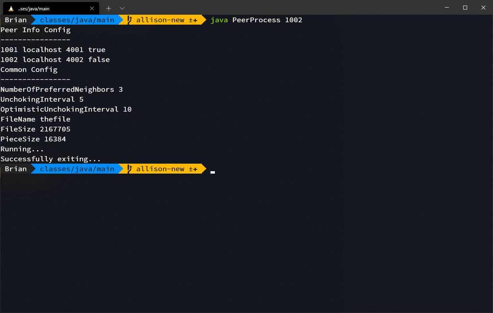

# Network Project Fall 2021


## Teammates

Allison Wu, Brian Koehler, Anurag Akkiraju

---

## Demonstration

[Click here](https://www.youtube.com/watch?v=zngbcE0L0qs) to visit our project demonstration video.

---

## Configuration

**NOTE: Any change in configuration requires the project to be rebuilt.**

The configuration file located at `network-project/PeerProcess/src/main/resources/Common.cfg` follows the same specifications outlined in the project description. Certify that `FileName` and `FileSize` are correct.

For example:

```
NumberOfPreferredNeighbors 3
UnchokingInterval 5
OptimisticUnchokingInterval 10
FileName thefile
FileSize 2167705
PieceSize 16384
```

The peers involved can also be configured at `network-project/PeerProcess/src/main/resources/PeerInfo.cfg`. This file also follows the specification located in the project description.

For example:

```
1001 localhost 4001 1
1002 localhost 4002 0
1003 localhost 4003 0
1004 localhost 4004 0
1005 localhost 4005 0
1006 localhost 4006 1
1007 localhost 4007 0
1008 localhost 4008 0
1009 localhost 4009 0
```

If a peer begins with the file, it must have its own directory in `network-project/PeerProcess/src/main/resources/` corresponding to its peer id, such as `1001/`. This directory should also contain the file it begins with.

For example, following the `PeerInfo.cfg` shown above, both `1001/` and `1006/` would be found in `network-project/PeerProcess/src/main/resources/`, and `thefile` would be located in both of those.

---

## Compilation

Compilation of this project requires the following:

- [IntelliJ IDEA](https://www.jetbrains.com/idea/)
- Gradle, Gradle Extension plugins for IntelliJ (installed by default)
- [Java Development Kit](https://adoptium.net/?variant=openjdk8) (Adopt Open 1.8 Recommended)
- Windows is recommended

In order to compile the project:

1. Download the zip file that is submitted.

2. Unzip the downloaded file.

3. Launch IntelliJ. You should see the window pictured below.


4. Select Open, then navigate to and open `/network-project/PeerProcess/` from the unzipped file.

5. A new window should open appearing like below. If you wish to configure anything before building, please refer to the [Configuration](#configuration) section. 


6. In the project tree on the left, expand `src/main/`. There should be two directories inside: `java/` and `resources/`. Right click `java/` and select Mark Directory as Sources Root. Then right click `resources/` and select Mark Directory as Resources Root. If these options are not available, skip this step.


5. Now right click `PeerProcess/` in the project tree and click the Build Module 'PeerProcess' option.


6. Open the build tab in the bottom left and ensure that the console reads `BUILD SUCCESSFUL` (view previous screenshot).

---

## Compilation Without IntelliJ IDEA (For CISE Machines)

If you would instead like to build the project without IntelliJ, follow the instructions below.

1. Download the zip file that is submitted.

2. Unzip the downloaded file.

3. Navigate to `network-project/PeerProcess/src/main/java` in your terminal and run the following command: `rm -rf ../../../build mkdir ../../../build && javac -d ../../../build/classes/java/main *.java && cd ../../../build && mkdir resources && cd resources && mkdir main && cd main && mkdir 1001 && cp ../../../src/main/resources/PeerInfo.cfg ./PeerInfo.cfg && cp ../../../src/main/resources/Common.cfg ./Common.cfg && cp ../../../src/main/resources/1001/thefile ./1001/thefile && cd ../../classes/java/main/`

---

## Execution

The example here will only be with 2 peers. However, as seen in the demonstration video, more peers may be used if [configured correctly](#configuration).

In order to execute the project:

1. Follow the compilation directions from the previous section.

2. Navigate to `network-project/PeerProcess/build/classes/java/main/` in the unzipped file from yout terminal.

3. Run the command `java PeerProcess 1001`. You should see output similar to the screenshot below.


4. In order to run a second peer locally, open a separate terminal window and follow steps 2 and 3, but replace `1001` with `1002`. The output should be similar too the screenshot below.



5. After execution, you may find a summary and individual peer logs in `network-project/PeerProcess/build/resources/main/`. **NOTE: The summary log must be deleted before each run to have an updated version.**

---

## Resources folder hierarchy (post-execution)

After executing the solution (see instructions here [here](#execution)), `network-project/PeerProcess/build/resources/main` should look similar to the screenshot below.


### Hierarchy Description
1. `network-project/PeerProcess/build/resources/main/<id>`
  - Directory containing the peers pieces and file
    - *Ex: Peer 1001 has `network-project/PeerProcess/build/resources/main/1001`*
    - `network-project/PeerProcess/build/resources/main/<id>/pieces`
      - *Ex: Peer 1001's piece 50 is at `network-project/PeerProcess/build/resources/main/1001/pieces/50`*
      - Contains all pieces files that make up the file  
    - `network-project/PeerProcess/build/resources/main/<id>/<filename>`
      - *Ex: Peer 1001's completed file, tree.jpg, is at `network-project/PeerProcess/build/resources/main/1001/tree.jpg`*
      - The path to the target file
3. `network-project/PeerProcess/build/resources/main/log_peer_<id>`
   - *Ex: Peer 1001 logs everything to `network-project/PeerProcess/build/resources/main/log_peer_1001`*
   - Contains all of a peers message and event logs 
4. `network-project/PeerProcess/build/resources/main/summary`
   - All peers log their completion statement to this file
5. All other files in the resources folder are unchanged after compilation 


